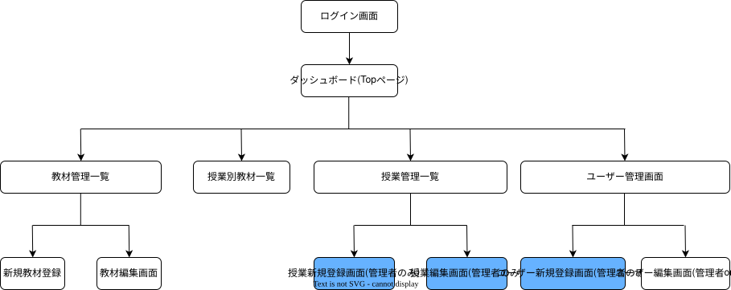

# Kyozai Link

## アプリケーション概要
Kyozai Linkは、高等学校における次年度の教材管理業務を支援するWebアプリケーションです。

従来の業務では、教科責任者が作成した教材情報をCSVで既存システムへ取り込むことも可能でしたが、取り込みには教科書IDなどのシステム固有の情報を事前に付与する必要があり、そのままでは利用できませんでした。そのため、教材管理担当者がCSVの加工や転記、授業と教材の紐付け、登録内容の確認を行う必要があり、業務が担当者の知識や経験に依存していました。

Kyozai Linkでは、教科責任者が次年度に開講する授業ごとに使用する教材を直接登録・紐付けし、その情報を一元管理できます。これにより、教材管理担当者が行っていた中間的なデータ加工や転記作業を減らし、教科書会社や生徒へ正確な教材情報を伝えるための業務を効率化します。

## URL

## テスト用アカウント

## 利用方法

## アプリケーションを作成した背景
自身が教科書事務担当として教材管理業務を行っていた際、業務が属人化しており、担当者の知識や経験に依存する部分が多いことに課題を感じました。また、複数のシステムやデータ間で転記・加工・確認を繰り返す必要があり、その過程で人的ミスが発生しやすい状況でした。

これらの課題を改善し、教材情報をより正確かつ効率的に管理できるようにするため、本アプリケーションを開発しました。

## 実装した機能

### ユーザー認証
- ログイン・ログアウト機能
- 一般ユーザーとシステム管理者の2種類の権限を設定

### ダッシュボード
ログイン後のダッシュボードから、以下の各機能へアクセスできます。

- 教材登録
- 授業別教材一覧
- ユーザー一覧
- 授業管理

ユーザーの権限に応じて、利用できる機能や操作できる教科を制限しています。

### 教材管理
授業で使用する教材の登録・管理を行うことができます。

教材には以下の情報を登録できます。

- 教材名
- 出版社
- 教材種別（教科書・副教材）
- 価格
- 教科

権限によって操作できる教科を制限しています。

- 一般ユーザー：自身が担当する教科の教材のみ登録・編集・削除可能
- システム管理者：すべての教科の教材を登録・編集・削除可能

登録した教材は教材管理画面から一覧で確認できます。

### 授業別教材設定
登録されている授業と、その授業で使用する教材を紐付けることができます。

教科ごとに授業と教材を確認し、使用する教材を選択して登録できます。

権限によって操作できる教科を制限しています。

- 一般ユーザー：自身が担当する教科のみ設定可能
- システム管理者：すべての教科を設定可能

### ユーザー管理
登録されているユーザーの情報を一覧で確認できます。

一般ユーザーは、自身のユーザー情報を編集できます。

- ユーザー名の変更
- パスワードの変更

システム管理者は、すべてのユーザーを管理できます。

- 新規ユーザーの登録
- ユーザー情報の編集
- ユーザーの削除
- 管理権限の設定
- 担当教科の設定

### 授業管理
次年度に開講する授業の登録・編集・削除を行うことができます。

授業には以下の情報を設定できます。

- 授業名
- 学年
- 教科
- 年度

授業の登録・編集・削除はシステム管理者のみ行うことができ、すべての教科の授業を管理できます。

## 実装予定の機能
MVPとして、教材情報の登録、授業と教材の紐付け、授業別の教材情報の確認までを実装しました。

将来的には、生徒情報や履修情報と連携し、以下の機能を追加する予定です。

- 生徒ごとの使用教材一覧の表示
- 生徒ごとの教材費合計の算出
- 教材ごとの必要冊数の集計
- 教科書会社へ提出する発注用一覧の作成
- CSVによる教材情報の一括登録
- CSVによる授業情報の一括登録

生徒別の教材一覧や教材費、必要冊数、発注用一覧を実現するためには、生徒情報や履修情報の管理、教材価格、集計処理など、追加のデータベース設計や機能実装が必要となります。

また、授業・教材情報については、より大量のデータを効率的に登録できるよう、CSVによる一括登録機能の追加を予定しています。

今後は、これらの機能を段階的に実装し、実際の教材管理業務をより広く支援できるアプリケーションへ拡張する予定です。

## データベース設計


## 画面遷移図


## 開発環境

### バックエンド
- Ruby 3.2.0
- Ruby on Rails 7.1.6

### データベース
- MySQL

### 認証
- Devise（ユーザー認証）

### テスト
- RSpec
- FactoryBot
- Capybara
- Selenium WebDriver

### コード品質
- RuboCop

### バージョン管理
- Git
- GitHub

## ローカルでの動作方法

以下のコマンドを順に実行してください。

### 1. リポジトリをクローン
```bash
git clone https://github.com/kentsu0901/kyozai_link.git
cd kyozai_link
```

### 2. Gemをインストール
```bash
bundle install
```

### 3. データベースを作成
```bash
rails db:create
```

### 4. マイグレーションを実行
```bash
rails db:migrate
```

### 5. 初期データを登録
教科や年度など、アプリケーションの動作に必要な初期データを登録します。

```bash
rails db:seed
```

### 6. Railsサーバーを起動
```bash
rails s
```

サーバー起動後、ブラウザから `http://localhost:3000` にアクセスしてください。

## 工夫したポイント
実際の教科書事務担当としての経験をもとに、教材管理担当者に集中していた作業を、教科責任者が直接行える仕組みを意識して設計しました。

従来は、教科責任者から提出された教材情報に対して、教材管理担当者がシステム固有の情報を付与したうえでCSVを加工・取り込みし、さらに授業と教材の紐付けや登録内容の確認を行う必要がありました。

本アプリケーションでは、教科責任者が自身の担当教科の教材を直接登録し、授業と教材を紐付けられるようにしました。また、一般ユーザーは担当教科のみ操作でき、システム管理者はすべての教科を管理できるよう権限を分けています。

これにより、教材管理担当者による中間的なデータ加工や転記作業を削減するとともに、特定の担当者の知識や経験に依存しにくい教材管理を目指しました。

## 改善点
現状では授業に年度情報を持たせていますが、MVPでは次年度（2027年度）のみを対象としているため、年度情報を十分に活用できていません。

今後、複数年度の教材情報を管理できるようにし、年度ごとの授業・教材情報の切り替えや、過年度の登録内容を参照できる機能を追加することで、年度情報を活用した継続的な教材管理ができるよう改善したいと考えています。

## 制作時間
約1週間