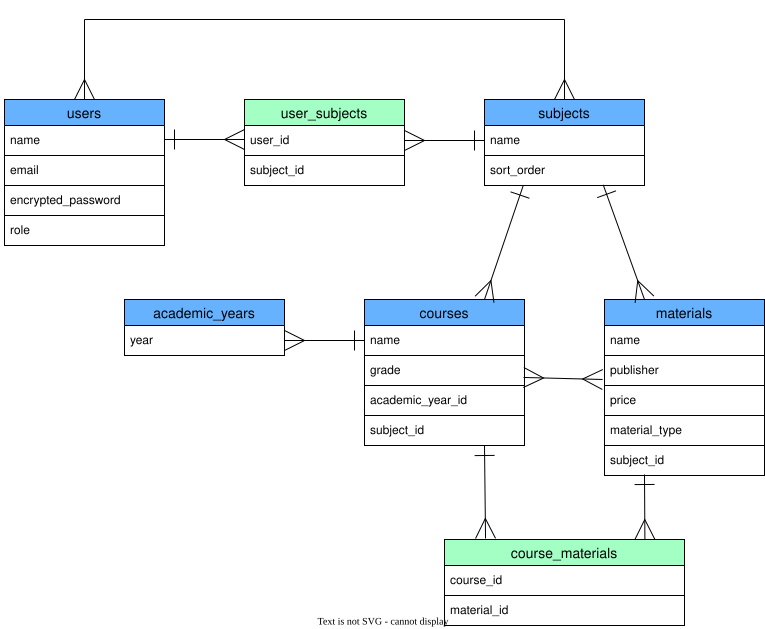

# Kyozai Link

## アプリケーション概要
Kyozai Linkは、高等学校における次年度の教材管理業務を支援するWebアプリケーションです。

教科責任者が、次年度に開講する授業ごとに使用する教材を直接登録・紐付けし、その情報を一元管理できます。これにより、教材管理担当者が行っていたCSV加工や転記、授業と教材の紐付け、登録内容の再確認といった中間作業を減らし、教科書会社や生徒へ正確な教材情報を伝えるための業務を効率化します。
## URL

## テスト用アカウント

## 利用方法

## アプリケーションを作成した背景
自身が教科書事務担当として教材管理業務を行っていた際、業務が属人化しており、担当者の知識や経験に依存する部分が多いことに課題を感じました。また、複数のシステムやデータ間で転記・加工・確認を繰り返す必要があり、その過程で人的ミスが発生しやすい状況でした。これらの課題を改善し、教材情報をより正確かつ効率的に管理できるようにするため、本アプリケーションを開発しようと考えました。
## 実装した機能

## 実装予定の機能

## データベース設計

## 画面遷移図

## 開発環境

## ローカルでの動作方法

## 工夫したポイント

## 改善点

## 制作時間
